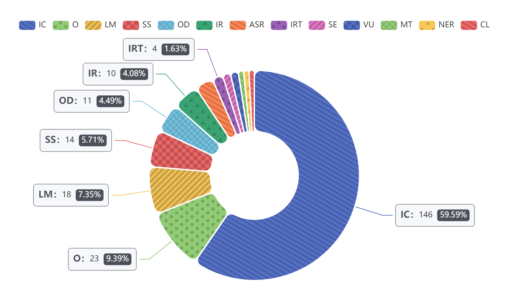

# Paper Lists of Neural Architecture Search

This document lists the papers published from 2017 to February 2021 on Neural Architecture Search (NAS). We categorize these papers into popular topics and collect the code for them.

## Outline

- [Paper Lists of Neural Architecture Search](#paper-lists-of-neural-architecture-search)
  - [Outline](#outline)
  - [Statistics](#statistics)
  - [A Short List](#a-short-list)
  - [A Long List](#a-long-list)
    - [1 Surveys - S](#1-surveys---s)
    - [2 Methods](#2-methods)
      - [2.1 Search Space - SP](#21-search-space---sp)
      - [2.2 Search Strategy](#22-search-strategy)
        - [2.2.1 Reinforcement Learning Methods - RL](#221-reinforcement-learning-methods---rl)
        - [2.2.2 Gradient-based Methods - G](#222-gradient-based-methods---g)
        - [2.2.3 Evolutionary Algorithms - EA](#223-evolutionary-algorithms---ea)
        - [2.2.4 Bayesian Optimization - BO](#224-bayesian-optimization---bo)
      - [2.3 Performance Prediction - PD](#23-performance-prediction---pd)
      - [2.4 Others - O](#24-others---o)
    - [3 Systems](#3-systems)
  - [Team Members](#team-members)

* Code
  > *We find the code for some of the papers (if there are any).*
  > *Parentheses in code links indicate that the code was not written by the author of the paper. (like* [(github)](https://github.com/)*)*

* Task
  > *We summarize the tasks of these papers according to the experiments described in them.*
  > *For notational simplicity, we use short names of the tasks (in alphabetical order).*
  > + ASR (Automatic Speech Recognition)
  >   + speech recognition
  >   + speaker verification
  >   + speaker identification
  >   + acoustic scene classification
  >   + keyword spotting
  >   + spoken language identification
  >   + multilingual speech recognition
  > + CL
  >   + object classification
  >   + scene classification
  >   + point cloud classification
  >   + node classification
  > + IC (Image Classification)
  > + IR (Image Recognition)
  > + IRT (Image ResToration)
  >   + image inpainting
  >   + image denoising
  >   + image de-raining
  >   + image restoration
  > + LM (Language Model)
  > + MT (Machine Translation)
  > + NER (Named Entity Recognition)
  > + O (Other)
  > + OD (Object Detection)
  > + SE
  >   + instance segmentation
  >   + OAR segmentation
  > + SS (Semantic Segmentation)
  > + VU (Video Understanding)

* Info
  > *Info is an extension of the paper introduction, including Title, Author, Abstract and Bib.*

* A Short List
  > *For a quick look at the field, here is a short list of must-read papers.*
  > *In this section, we list some highly cited papers, and we also recommend some papers that may be helpful for beginners (bold).*

## Statistics

Figure 1: Number of papers published in NAS field in recent four years.

Figure 2: Number of papers for each Type in recent years.(See Outline for Type details)

Figure 3: Number of papers in each Task area in recent years.(See Outline for Task details)

Figure 4: The word cloud for NAS.

## A Short List

| Title                                    |   Type  |  Task  |                   Code                   | Year | Info | Citations |
| :--------------------------------------- | :-----: | :----: | :--------------------------------------: | :--: | :--: | :-------: |
| [**Neural Architecture Search with Reinforcement Learning**](https://openreview.net/forum?id=r1Ue8Hcxg) |  RL   |    IC LM     |                    -                     | 2017 | [details](./info/short-list-info/Zoph2017Neural.md) | 2425 |
| [Learning Transferable Architectures for Scalable Image Recognition](https://ieeexplore.ieee.org/document/8579005) |  RL   |    IC     | [github](https://github.com/tensorflow/models/tree/master/research/slim/nets/nasnet) | 2018 | [details](./info/short-list-info/Zoph2018Learning.md) | 2455 |
| [**DARTS: Differentiable Architecture Search**](https://openreview.net/forum?id=S1eYHoC5FX) |  G   |  IC  LM   | [github](https://github.com/quark0/darts) | 2018 | [details](./info/short-list-info/Liu2018DARTS.md) | 1241 |
| [**Efficient Neural Architecture Search via Parameter Sharing**](http://proceedings.mlr.press/v80/pham18a.html) |  RL   |    LM IC     | [github](https://github.com/carpedm20/ENAS-pytorch) | 2018 | [details](./info/short-list-info/Pham2018Efficient.md) | 1142 |
| [Regularized Evolution for Image Classifier Architecture Search](https://aaai.org/ojs/index.php/AAAI/article/view/4405) | EA  |  IC   |                    -                     | 2018 | [details](./info/short-list-info/Real2019Regularized.md) | 1071 |
| [Progressive Neural Architecture Search](https://openaccess.thecvf.com/content_ECCV_2018/html/Chenxi_Liu_Progressive_Neural_Architecture_ECCV_2018_paper.html) |  PD  |  IC   | [github](https://github.com/chenxi116/PNASNet.pytorch) | 2018 | [details](./info/short-list-info/Liu2018Progressive.md) | 951 |
| [**Neural architecture search: A survey**](http://jmlr.org/papers/v20/18-598.html) | -  | - |                   -                     | 2018 | [details](info/short-list-info/Elsken2019Neural.md) | 727 |
| [Large-Scale Evolution of Image Classifiers](http://proceedings.mlr.press/v70/real17a.html) | EA  |  IC   |                    -                     | 2017 | [details](./info/short-list-info/Real2017Large.md) | 852 |
| [Designing Neural Network Architectures using Reinforcement Learning](https://openreview.net/forum?id=S1c2cvqee) |  RL   |    IC     | [github](https://github.com/bowenbaker/metaqnn) | 2017 | [details](./info/short-list-info/Baker2017Designing.md) | 756 |
| [MnasNet: Platform-Aware Neural Architecture Search for Mobile](https://ieeexplore.ieee.org/document/8954198/) |  RL   |   IC IR   | [github](https://github.com/AnjieZheng/MnasNet-PyTorch) | 2018 | [details](./info/short-list-info/Tan2018MnasNet.md) | 883 |
| [Hyperband: A Novel Bandit-Based Approach to Hyperparameter Optimization](https://arxiv.org/abs/1603.06560) |  PD  |  IC   |                    -                     | 2017 | [details](./info/short-list-info/Li2017Hyperband.md) | 642 |
| [ProxylessNAS: Direct Neural Architecture Search on Target Task and Hardware](https://openreview.net/forum?id=HylVB3AqYm) |  RL/G   |   IC    | [github](https://github.com/MIT-HAN-LAB/ProxylessNAS) | 2019 | [details](./info/short-list-info/Cai2019ProxylessNAS.md) | 650 |
| [Searching for MobileNetV3](https://openaccess.thecvf.com/content_ICCV_2019/html/Howard_Searching_for_MobileNetV3_ICCV_2019_paper.html) |  O   |     IC OD SS     | [(github)](https://github.com/leaderj1001/MobileNetV3-Pytorch) | 2019 | [details](./info/short-list-info/Howard2019Searching.md) | 606 |
| [**Neural Architecture Optimization**](http://papers.nips.cc/paper/8007-neural-architecture-optimization) | G |  IC LM   | [github](https://github.com/renqianluo/NAO) | 2018 | [details](info/short-list-info/Luo2018Nerual.md) | 300 |
| [Auto-DeepLab: Hierarchical Neural Architecture Search for Semantic Image Segmentation](https://ieeexplore.ieee.org/document/8954247/) |  G   |  SS   | [gitHub](https://github.com/tensorflow/models/tree/master/research/deeplab) | 2019 | [details](./info/short-list-info/Liu2019Auto-DeepLab.md) | 392 |
| [FBNet: Hardware-Aware Efficient ConvNet Design via Differentiable Neural Architecture Search](https://ieeexplore.ieee.org/document/8953587/) |  G   |   IC    | [github](https://github.com/facebookresearch/mobile-vision) | 2019 | [details](./info/short-list-info/Wu2019FBNet.md) | 412 |
| [SNAS: stochastic neural architecture search](https://openreview.net/forum?id=rylqooRqK7) |  G    |  IC  | [github](https://github.com/SNAS-Series/SNAS-Series/tree/master/SNAS) | 2019 | [details](./info/short-list-info/Xie2019SNAS.md) | 366 |
| [**Random Search and Reproducibility for Neural Architecture Search**](http://auai.org/uai2019/proceedings/papers/129.pdf) |   G   |  IC LM   | [github](https://github.com/D-X-Y/NAS-Projects/blob/master/scripts-search/algos/RANDOM-NAS.sh) | 2019 | [details](info/short-list-info/Li2019Random.md) | 224 |
| [**Single Path One-Shot Neural Architecture Search with Uniform Sampling**](https://www.ecva.net/papers/eccv_2020/papers_ECCV/papers/123610528.pdf) |   EA   |    IC    | [github](https://github.com/megvii-model/SinglePathOneShot)  | 2020 |      [details](info/short-list-info/GuoZMHLWS20.md)      |    174    |
| [Once for All: Train One Network and Specialize it for Efficient Deployment](https://openreview.net/pdf?id=HylxE1HKwS) |   G    |  IC OD   |    [github](https://github.com/mit-han-lab/once-for-all)     | 2020 |         [details](info/short-list-info/OFA20.md)         |    150    |
| [The Evolved Transformer](http://proceedings.mlr.press/v97/so19a/so19a.pdf) |   RL   |  LM MT   |                              -                               | 2019 | [details](info/short-list-info/EvolvedTransformer19.md)  |    144    |
| [**Neural Network Intelligence**](https://nni.readthedocs.io/en/latest/) |   System    |   -    | [github](https://github.com/microsoft/nni) |  -   |   -    | - |

## A Long List

### 1 Surveys - S
| Title                                    |  Venue  |                   Code                   | Year | Info |
| :--------------------------------------- | :-----: | :--------------------------------------: | :--: | :--: |
| [Neural architecture search: A survey](http://jmlr.org/papers/v20/18-598.html) | JMLR  |                    -                     | 2018 |[details](info/Elsken2019Neural.md) |
| [A Survey on Neural Architecture Search](https://arxiv.org/abs/1905.01392) |   -   |                    -                     | 2019 | [details](info/Wistuba2019A.md) |
| [Reinforcement Learning for Neural Architecture Search: A Review](https://www.sciencedirect.com/science/article/abs/pii/S0262885619300885) |  IVC  |                    -                     | 2019 |[details](info/Jaafra2019Reinforcement.md) |
| [A Comprehensive Survey of Neural Architecture Search: Challenges and Solutions](https://arxiv.org/abs/2006.02903) |   -   |                  -                       | 2020 | [details](info/Ren2020A.md) |
| [Evaluating The Search Phase of Neural Architecture Search](https://openreview.net/forum?id=H1loF2NFwr) | ICLR  | [github](https://github.com/kcyu2014/eval-nas) | 2020 |[details](info/Yu2020Evaluating.md) |
| [NAS evaluation is frustratingly hard](https://openreview.net/forum?id=HygrdpVKvr) | ICLR | [github](https://github.com/antoyang/NAS-Benchmark) | 2020 | [details](info/Yang2020NAS.md) |

### 2 Methods
#### 2.1 Search Space - SP
| Title                                    |  Venue  | Task |                    Code                  | Year | Info |
| :--------------------------------------- | :-----: | :--: | :--------------------------------------: | :--: | :--: |
| [GitGraph - from Computational Subgraphs to Smaller Architecture Search Spaces](https://openreview.net/forum?id=rkiO1_1Pz) |  ICLR  |  - | - | 2018 | [details](info/Bennani-Smires2018GitGraph.md) |
| [Searching for efficient multi-scale architectures for dense image prediction](http://papers.nips.cc/paper/8087-searching-for-efficient-multi-scale-architectures-for-dense-image-prediction) |  NeurIPS  | IR |       -          | 2018 |[details](info/Chen2018Searching.md) |
| [Towards modular and programmable architecture search](https://papers.nips.cc/paper/9524-towards-modular-and-programmable-architecture-search.html) |  NeurIPS  |   - | [github](https://github.com/negrinho/deep_architect) | 2019 | [details](info/Negrinho2019Towards.md) |
| [MFAS: Multimodal Fusion Architecture Search](https://ieeexplore.ieee.org/document/8954353) | CVPR  |  VU   |                    -                     | 2019 | [details](./info/Perez-Rua2019MFAS.md) |
| [NAS-Bench-101: Towards Reproducible Neural Architecture Search](http://proceedings.mlr.press/v97/ying19a.html) |   ICML    |    IC     | [github](https://github.com/google-research/nasbench) | 2019 | [details](info/Ying2019NAS.md) |
| [Auto-ReID: Searching for a Part-Aware ConvNet for Person Re-Identification](https://openaccess.thecvf.com/content_ICCV_2019/html/Quan_Auto-ReID_Searching_for_a_Part-Aware_ConvNet_for_Person_Re-Identification_ICCV_2019_paper.html) |  ICCV   |     IR    | - | 2019 | [details](info/Quan2019Auto-ReID.md) |
| [Exploring Randomly Wired Neural Networks for Image Recognition](https://openaccess.thecvf.com/content_ICCV_2019/html/Xie_Exploring_Randomly_Wired_Neural_Networks_for_Image_Recognition_ICCV_2019_paper.html) |  ICCV   |     IC OD    | [(github)](https://github.com/seungwonpark/RandWireNN) | 2019 | [details](info/Xie2019Exploring.md) |
| [NAS-Bench-1Shot1: Benchmarking and Dissecting One-shot Neural Architecture Search](https://openreview.net/forum?id=SJx9ngStPH) |  ICLR   |     -    | [github](https://github.com/automl/nasbench-1shot1) | 2020 | [details](./info/Zela2020NAS.md) |
| [NAS-BENCH-201: Extending the Scope of Reproducible Neural Architecture Search](https://openreview.net/forum?id=HJxyZkBKDr) |   ICLR    |    IC     | [github](https://github.com/D-X-Y/AutoDL-Projects) | 2020 | [details](./info/Dong2020NAS.md) |
| [AutoShrink: A Topology-aware NAS for Discovering Efficient Neural Architecture](https://aaai.org/ojs/index.php/AAAI/article/view/6163) |  AAAI   |     IC LM    | [github](https://github.com/lordzth666/AutoShrink) | 2020 | [details](./info/Zhang2020AutoShrink.md) |
| [TextNAS: A Neural Architecture Search Space tailored for Text Representation](https://aaai.org/ojs/index.php/AAAI/article/view/6462) |   AAAI  |     O    | [github](https://github.com/microsoft/nni/tree/master/examples/nas/textnas) | 2020 | [details](./info/Wang2020TextNAS.md) |
| [Angle-based Search Space Shrinking for Neural Architecture Search](https://arxiv.org/abs/2004.13431) |  ECCV   |     IC    | - | 2020 | [details](info/Hu2020Angle-based.md) |
| [Graph-Guided Architecture Search for Real-Time Semantic Segmentation](https://ieeexplore.ieee.org/abstract/document/9157730) |  CVPR   |     SS    | - | 2020 | [details](./info/Lin2020Graph.md) |
| [MnasFPN : Learning Latency-aware Pyramid Architecture for Object Detection on Mobile Devices](https://ieeexplore.ieee.org/abstract/document/9156863) |  CVPR   |     OD    | - | 2020 | [details](./info/Chen2020MnasFPN.md) |
| [SP-NAS: Serial-to-Parallel Backbone Search for Object Detection](https://ieeexplore.ieee.org/abstract/document/9156649/) |  CVPR   |     OD    | - | 2020 | [details](./info/Jiang2020SP.md) |
| [FENAS: Flexible and Expressive Neural Architecture Search](https://www.aclweb.org/anthology/2020.findings-emnlp.258/) |  EMNLP   |     LM O    | - | 2020 | [details](./info/Pasunuru2020FENAS.md) |
| [ISTA-NAS: Efficient and Consistent Neural Architecture Search by Sparse Coding](https://proceedings.neurips.cc/paper/2020/hash/76cf99d3614e23eabab16fb27e944bf9-Abstract.html) |NeurIPS | IC | [github](https://github.com/iboing/ISTA-NAS) | 2020 | [details](info/Yang2020ISTA-NAS.md) |
| [Neural Architecture Generator Optimization](https://proceedings.neurips.cc/paper/2020/hash/8c53d30ad023ce50140181f713059ddf-Abstract.html) | NeurIPS | IC IR | [github](https://github.com/huawei-noah/vega/) | 2020 | [details](info/Ru2020Neural.md) |
| [CLEARER: Multi-Scale Neural Architecture Search for Image Restoration](https://proceedings.neurips.cc/paper/2020/hash/c6e81542b125c36346d9167691b8bd09-Abstract.html) | NeurIPS | IRT | [github](https://github.com/limit-scu) | 2020 | [details](info/Gou2020CLEARER.md) |
| [RandAugment: Practical Automated Data Augmentation with a Reduced Search Space](https://proceedings.neurips.cc/paper/2020/hash/d85b63ef0ccb114d0a3bb7b7d808028f-Abstract.html) | NeurIPS| IC | [github](github.com/tensorflow/tpu/tree/master/models/official/efficientnet) | 2020 | [details](info/Cubuk2020RandAugment.md) |
| [Evolved Speech-Transformer: Applying Neural Architecture Search to End-to-End Automatic Speech Recognition](https://www.isca-speech.org/archive/Interspeech_2020/abstracts/1233.html) |   INTERSPEECH  |     ASR    | - | 2020 | [details](info/Kim2020Evolved.md) |
| [NAS-Bench-ASR: Reproducible Neural Architecture Search for Speech Recognition](https://openreview.net/forum?id=CU0APx9LMaL) |   ICLR  |     O    | - | 2021 | [details](info/Mehrotra2021NAS-Bench-ASR.md) |
| [HW-NAS-Bench: Hardware-Aware Neural Architecture Search Benchmark](https://openreview.net/forum?id=_0kaDkv3dVf) |   ICLR  |     IC    | [github](https://github.com/RICE-EIC/HW-NAS-Bench) | 2021 | [details](info/Li2021HW-NAS-Bench.md) |

#### 2.2 Search Strategy
##### 2.2.1 Reinforcement Learning Methods - RL
| Title                                    |  Venue  | Task |                    Code                  | Year | Info |
| :--------------------------------------- | :-----: | :--: | :--------------------------------------: | :--: | :--: |
| [Neural Architecture Search with Reinforcement Learning](https://openreview.net/forum?id=r1Ue8Hcxg) |  ICLR   |   IC LM  |                    -                     | 2017 | [details](info/Zoph2017Neural.md) |
| [Learning to Compose Domain-Specific Transformations for Data Augmentation](http://papers.nips.cc/paper/6916-learning-to-compose-domain-specific-transformations-for-data-augmentation) | NeurIPS | IC O |                       -                     | 2017 | [details](info/Ratner2017Learning.md) |
| [N2N learning: Network to Network Compression via Policy Gradient Reinforcement Learning](https://openreview.net/forum?id=B1hcZZ-AW) |  ICLR   | - |     -                     | 2017 | [details](info/Ashok2017N2N.md) |
| [Designing Neural Network Architectures using Reinforcement Learning](https://openreview.net/forum?id=S1c2cvqee) |  ICLR   |   IC    |   [github](https://github.com/bowenbaker/metaqnn) | 2017 |[details](info/Baker2017Designing.md) |
| [Neural Optimizer Search with Reinforcement Learning](http://proceedings.mlr.press/v70/bello17a.html) |  ICML   | IC |                -                     | 2017 |[details](info/Bello2017Neural.md) |
| [Efficient Neural Architecture Search via Parameter Sharing](http://proceedings.mlr.press/v80/pham18a.html) |  ICML   | LM IC  |    [github](https://github.com/carpedm20/ENAS-pytorch) | 2018 |[details](info/Pham2018Efficient.md)  |
| [Efficient Architecture Search by Network Transformation](https://www.aaai.org/ocs/index.php/AAAI/AAAI18/paper/view/16755) |  AAAI   | IC |  [github](https://github.com/han-cai/EAS) | 2018 |[details](info/Cai2018Efficient.md) |
| [A Flexible Approach to Automated RNN Architecture Generation](https://openreview.net/forum?id=SkOb1Fl0Z) |  ICLR   | MT |                   -                     | 2018 |[details](info/Schrimpf2017A.md) |
| [Learning Transferable Architectures for Scalable Image Recognition](https://ieeexplore.ieee.org/document/8579005) |  CVPR   | IC |    [github](https://github.com/tensorflow/models/tree/master/research/slim/nets/nasnet) | 2018 |[details](info/Zoph2018Learning.md) |
| [Practical Block-wise Neural Network Architecture Generation](https://ieeexplore.ieee.org/document/8578355/) |  CVPR   | IC |                      -                     | 2018 |[details](info/Zhong2018Practical.md) |
| [Path-Level Network Transformation for Efficient Architecture Search](http://proceedings.mlr.press/v80/cai18a.html) |  ICML  | IC |    [github](https://github.com/han-cai/PathLevel-EAS) | 2018 |[details](info/Cai2018Path-Level.md) |
| [MnasNet: Platform-Aware Neural Architecture Search for Mobile](https://ieeexplore.ieee.org/document/8954198/) |  CVPR   | IC IR |   [github](https://github.com/AnjieZheng/MnasNet-PyTorch) | 2018 |[details](info/Tan2018MnasNet.md) |
| [Faster Discovery of Neural Architectures by Searching for Paths in a Large Model](https://openreview.net/forum?id=rJkCq4JvM) |  ICLR  | LM IC |     - | 2018 | [details](info/Pham2018Faster.md) |
| [UNAS: Differentiable Architecture Search Meets Reinforcement Learning](https://ieeexplore.ieee.org/document/9156297/) |  CVPR  | IC |     - | 2018 |[details](info/Vahdat2018UNAS.md) |
| [Fast Neural Architecture Search of Compact Semantic Segmentation Models via Auxiliary Cells](https://ieeexplore.ieee.org/document/8953530/) |  CVPR   | SS IR |   [github](https://github.com/DrSleep/nas-segm-pytorch) | 2019 |[details](info/Nekrasov2019Fast.md) |
| [Reinforcement Learning for Neural Architecture Search: A Review](https://www.sciencedirect.com/science/article/abs/pii/S0262885619300885) |   ICV  | - |                      -                     | 2019 |[details](info/Jaafra2019Reinforcement.md) |
| [Can Weight Sharing Outperform Random Architecture Search? An Investigation With TuNAS](https://ieeexplore.ieee.org/document/9157751/) |  CVPR   | IC IR |                      -                     | 2019 | [details](info/Bender2019Can.md) |
| [Continual and Multi-Task Architecture Search](https://www.aclweb.org/anthology/P19-1185/) |   ACL   | O |  [github](https://www.aclweb.org/anthology/P19-1185/) | 2019 |[details](info/Pasunuru2019Continual.md) |
| [AutoGAN: Neural Architecture Search for Generative Adversarial Networks](https://openaccess.thecvf.com/content_ICCV_2019/html/Gong_AutoGAN_Neural_Architecture_Search_for_Generative_Adversarial_Networks_ICCV_2019_paper.html) |  ICCV   | IC |   [github](https://github.com/TAMU-VITA/AutoGAN) | 2019 |[details](info/Gong2019AutoGAN.md) |
| [ProxylessNAS: Direct Neural Architecture Search on Target Task and Hardware](https://openreview.net/forum?id=HylVB3AqYm) |  ICLR   | IC |   [github](https://github.com/MIT-HAN-LAB/ProxylessNAS) | 2019 |[details](info/Cai2019ProxylessNAS.md) |
| [IRLAS: Inverse Reinforcement Learning for Architecture Search](https://ieeexplore.ieee.org/document/8954365/) |  CVPR  | IC |   - | 2019 |[details](info/Guo2019IRLAS.md) |
| [RENAS: Reinforced Evolutionary Neural Architecture Search](https://ieeexplore.ieee.org/document/8953426/) |  CVPR   | IC SS | [github](https://github.com/yukang2017/RENAS) | 2019 |[details](info/Chen2019RENAS.md) |
| [AM-LFS: AutoML for Loss Function Search](https://openaccess.thecvf.com/content_ICCV_2019/html/Li_AM-LFS_AutoML_for_Loss_Function_Search_ICCV_2019_paper.html) |  ICCV  | IC IR | - | 2019 |[details](info/Li2019AM-LFS.md) |
| [NAT: Neural Architecture Transformer for Accurate and Compact Architectures](https://papers.nips.cc/paper/8362-nat-neural-architecture-transformer-for-accurate-and-compact-architectures.html) |  NeurlPS  | IC | [github](https://github.com/guoyongcs/NAT) | 2019 |[details](info/Guo2019NAT.md) |
| [NSGANetV2: Evolutionary Multi-Objective Surrogate-Assisted Neural Architecture Search](https://www.ecva.net/papers/eccv_2020/papers_ECCV/papers/123460035.pdf) |  ECCV  | IC | - | 2020 |[details](info/Luo2020NSGANetv2.md) |
| [S2DNAS: Transforming Static CNN Model for Dynamic Inference via Neural Architecture Search](https://arxiv.org/abs/1911.07033v2) |  ECCV  | IC | - | 2020 |[details](info/Yuan2020S2DNAS.md) |
| [Breaking the Curse of Space Explosion: Towards Efficient NAS with Curriculum Search](https://arxiv.org/abs/2007.07197) |  ICML  | IC | [github](https://github.com/guoyongcs/CNAS) | 2020 |[details](info/Guo2020Breaking.md) |
| [NAS-FCOS: Fast Neural Architecture Search for Object Detection](https://ieeexplore.ieee.org/document/9156326/) |  CVPR  | IC |  [github](https://github.com/Lausannen/NAS-FCOS) | 2020 |[details](info/Wang2020NAS-FCOS.md) |
| [Graph Neural Architecture Search](https://www.ijcai.org/Proceedings/2020/0195) |  IJCAI  |  O | [github](https://github.com/GraphNAS/GraphNAS) | 2020 |[details](info/Gao2020Graph.md) |
| [InstaNAS: Instance-aware Neural Architecture Search](https://aaai.org/ojs/index.php/AAAI/article/view/5764) |  AAAI  | IC | [github](https://github.com/AnjieCheng/InstaNAS) | 2020 | [details](info/Cheng2020InstaNAS.md) |
| [Towards Oracle Knowledge Distillation with Neural Architecture Search](https://aaai.org/ojs/index.php/AAAI/article/view/5866) |  AAAI  | IC |  - | 2020 |[details](info/Kang2020Towards.md) |
| [Sample-Efficient Automated Deep Reinforcement Learning](https://openreview.net/forum?id=hSjxQ3B7GWq) |   ICLR  |     -    | - | 2021 | [details](info/Franke2021Sample.md) |

##### 2.2.2 Gradient-based Methods - G
| Title                                    |  Venue  | Task |                   Code                   | Year | Info |
| :--------------------------------------- | :-----: | :--: | :--------------------------------------: | :--: | :--: |
| [DARTS: Differentiable Architecture Search](https://openreview.net/forum?id=S1eYHoC5FX) |  ICLR  | IC  LM| [github](https://github.com/quark0/darts) | 2018 |[details](info/Liu2018DARTS.md) |
| [Understanding and Simplifying One-Shot Architecture Search](http://proceedings.mlr.press/v80/bender18a.html) |  ICML   |  IC   |                    -                     | 2018 | [details](info/Bender2018Understanding.md) |
| [SMASH: One-Shot Model Architecture Search through HyperNetworks](https://openreview.net/forum?id=rydeCEhs-) |  ICLR   |  IC   | [github](https://github.com/ajbrock/SMASH) | 2018 | [details](info/Brock2018SMASH.md) |
| [Neural Architecture Optimization](http://papers.nips.cc/paper/8007-neural-architecture-optimization) | NeurIPS |  IC LM   | [github](https://github.com/renqianluo/NAO) | 2018 | [details](info/Luo2018Nerual.md) |
| [Differentiable Neural Network Architecture Search](https://openreview.net/forum?id=BJ-MRKkwG) | ICLR-W  |  O   |                    -                     | 2018 | [details](info/Shin2018Differentiable.md) |
| [ProxylessNAS: Direct Neural Architecture Search on Target Task and Hardware](https://openreview.net/forum?id=HylVB3AqYm) |  ICLR   | IC | [github](https://github.com/MIT-HAN-LAB/ProxylessNAS) | 2019 | [details](info/Cai2019ProxylessNAS.md) |
| [Graph HyperNetworks for Neural Architecture Search](https://openreview.net/forum?id=rkgW0oA9FX) |  ICLR   |  IC   |                    -                     | 2019 | [details](info/Zhang2018Graph.md) |
| [SNAS: stochastic neural architecture search](https://openreview.net/forum?id=rylqooRqK7) |  ICLR   |  IC   | [github](https://github.com/SNAS-Series/SNAS-Series/tree/master/SNAS) | 2019 | [details](info/Xie2019SNAS.md) |
| [FBNet: Hardware-Aware Efficient ConvNet Design via Differentiable Neural Architecture Search](https://ieeexplore.ieee.org/document/8953587/) |  CVPR   |   IC    | [github](https://github.com/facebookresearch/mobile-vision) | 2019 | [details](info/Wu2019FBNet.md) |
| [Auto-DeepLab: Hierarchical Neural Architecture Search for Semantic Image Segmentation](https://ieeexplore.ieee.org/document/8954247/) |  CVPR   |  SS   | [gitHub](https://github.com/tensorflow/models/tree/master/research/deeplab) | 2019 | [details](info/Liu2019Auto-DeepLab.md) |
| [AdversarialNAS: Adversarial Neural Architecture Search for GANs](https://ieeexplore.ieee.org/document/9157134/) |  CVPR   |  O   | [github](https://github.com/chengaopro/AdversarialNAS) | 2019 | [details](info/Gao2019AdversarialNAS.md) |
| [When NAS Meets Robustness: In Search of Robust Architectures against Adversarial Attacks](https://ieeexplore.ieee.org/document/9156305/) |  CVPR   |  O   | [github](https://github.com/gmh14/RobNets) | 2019 | [details](info/Gao2019When.md) |
| [Random Search and Reproducibility for Neural Architecture Search](http://auai.org/uai2019/proceedings/papers/129.pdf) |   UAI   |  IC LM   | [github](https://github.com/D-X-Y/NAS-Projects/blob/master/scripts-search/algos/RANDOM-NAS.sh) | 2019 | [details](info/Li2019Random.md) |
| [One-Shot Neural Architecture Search via Self-Evaluated Template Network](https://openaccess.thecvf.com/content_ICCV_2019/html/Dong_One-Shot_Neural_Architecture_Search_via_Self-Evaluated_Template_Network_ICCV_2019_paper.html) |  ICCV   |  IC   | [github](https://github.com/D-X-Y/NAS-Projects) | 2019 | [details](info/Dong2019One-Shot.md) |
| [Efficient Forward Architecture Search](https://papers.nips.cc/paper/9202-efficient-forward-architecture-search.html) | NeurIPS |  IC LM   | [github](https://github.com/microsoft/petridishnn) | 2019 | [details](info/Hu2019Efficient.md) |
| [Improved Differentiable Architecture Search for Language Modeling and Named Entity Recognition](https://www.aclweb.org/anthology/D19-1367/) |  EMNLP  |  NER   | [github](https://github.com/jiangyingjunn/i-darts) | 2019 | [details](info/Jiang2019Improved.md) |
| [Network Pruning via Transformable Architecture Search](https://arxiv.org/abs/1905.09717) | NeurIPS |  IC   | [github](https://github.com/D-X-Y/NAS-Projects) | 2019 | [details](info/Dong2019Network.md) |
| [XNAS: Neural Architecture Search with Expert Advice](https://papers.nips.cc/paper/8472-xnas-neural-architecture-search-with-expert-advice.html) | NeurIPS |  IC   | [github](https://github.com/NivNayman/XNAS) | 2019 | [details](info/Nayman2019XNAS.md) |
| [NetTailor: Tuning the Architecture, Not Just the Weights](https://ieeexplore.ieee.org/document/8953794) |  CVPR   |  O   | [github](https://github.com/pedro-morgado/nettailor) | 2019 | [details](info/Morgado2019NetTailor.md) |
| [Searching for A Robust Neural Architecture in Four GPU Hours](https://ieeexplore.ieee.org/document/8953848/) |  CVPR   |  IC LM   | [github](https://github.com/D-X-Y/NAS-Projects) | 2019 | [details](info/Dong2019Searching.md) |
| [Progressive Differentiable Architecture Search: Bridging the Depth Gap Between Search and Evaluation](https://openaccess.thecvf.com/content_ICCV_2019/html/Chen_Progressive_Differentiable_Architecture_Search_Bridging_the_Depth_Gap_Between_Search_ICCV_2019_paper.html) |  ICCV   |  IC   | [github](https://github.com/chenxin061/pdarts) | 2019 | [details](info/Chen2019Progressive.md) |
| [Customizable Architecture Search for Semantic Segmentation](https://ieeexplore.ieee.org/document/8953370) |  CVPR   |  SS   |                    -                     | 2019 | [details](info/Zhang2019Customizable.md) |
| [Auto-FPN: Automatic Network Architecture Adaptation for Object Detection Beyond Classification](https://openaccess.thecvf.com/content_ICCV_2019/html/Xu_Auto-FPN_Automatic_Network_Architecture_Adaptation_for_Object_Detection_Beyond_Classification_ICCV_2019_paper.html) |  ICCV  |    OD    | - | 2019 | [details](info/Xu2019Auto-FPN.md) |
| [Meta Architecture Search](https://papers.nips.cc/paper/9301-meta-architecture-search.html) |  NeurlPS  |    IC    | [github](https://github.com/ashaw596/meta_architecture_search) | 2019 | [details](info/Shaw2019Meta.md) |
| [Efficient Neural Architecture Transformation Search in Channel-Level for Object Detection](https://papers.nips.cc/paper/9576-efficient-neural-architecture-transformation-search-in-channel-level-for-object-detection.html) |  NeurlPS  |    OD    | - | 2019 | [details](info/Peng2019Efficient.md) |
| [DATA: Differentiable ArchiTecture Approximation](https://papers.nips.cc/paper/8374-data-differentiable-architecture-approximation.html) |  NeurlPS  |    IC LM SS    | [github](https://github.com/XinbangZhang/DATA-NAS) | 2019 | [details](info/Chang2019DATA.md) |
| [Adaptive Stochastic Natural Gradient Method for One-Shot Neural Architecture Search](http://proceedings.mlr.press/v97/akimoto19a.html) |  ICML  |    IC IRT    | [github](https://github.com/shirakawas/ASNG-NAS) | 2019 | [details](info/Akimoto2019Adaptive.md) |
| [BayesNAS: A Bayesian Approach for Neural Architecture Search](http://proceedings.mlr.press/v97/zhou19e.html) |  ICML  |    IC    | [github](https://github.com/BayesNAS) | 2019 | [details](info/Zhou2019BayesNAS.md) |
| [MiLeNAS: Efficient Neural Architecture Search via Mixed-Level Reformulation](https://ieeexplore.ieee.org/document/9156336/) |  CVPR   |  IC   | [github](https://github.com/chaoyanghe/MiLeNAS) | 2020 | [details](info/He2020MiLeNAS.md) |
| [APQ: Joint Search for Network Architecture, Pruning and Quantization Policy](https://ieeexplore.ieee.org/document/9156411/) |  CVPR   |  IC   | [github](https://github.com/mit-han-lab/apq) | 2020 | [details](info/Wang2020APQ.md) |
| [SGAS: Sequential Greedy Architecture Search](https://ieeexplore.ieee.org/document/9157406/) |  CVPR   |  IC CL   | [github](https://github.com/lightaime/sgas) | 2020 | [details](info/Li2020SGAS.md) |
| [FBNetV2: Differentiable Neural Architecture Search for Spatial and Channel Dimensions](https://ieeexplore.ieee.org/document/9156431/) |  CVPR   |  IC   | [github](https://github.com/facebookresearch/mobile-vision) | 2020 | [details](info/Wan2020FBNetV2.md) |
| [Block-wisely Supervised Neural Architecture Search with Knowledge Distillation](https://ieeexplore.ieee.org/document/9157026/) |  CVPR   |  IC   | [github](https://github.com/changlin31/DNA) | 2020 | [details](info/Li2020Block-wisely.md) |
| [Overcoming Multi-Model Forgetting in One-Shot NAS with Diversity Maximization](https://ieeexplore.ieee.org/document/9156768/) |  CVPR   |  IC  LM   | [github](https://github.com/MiaoZhang0525/NSAS_FOR_CVPR) | 2020 | [details](info/Zhang2020Overcoming.md) |
| [Densely Connected Search Space for More Flexible Neural Architecture Search](https://ieeexplore.ieee.org/document/9156957/) |  CVPR   |  IC  OD   | [github](https://github.com/JaminFong/DenseNAS) | 2020 | [details](info/Fang2020Densely.md) |
| [Understanding Architectures Learnt by Cell-based Neural Architecture Search](https://openreview.net/forum?id=BJxH22EKPS) |  ICLR   |  IC   | [github](https://github.com/shuyao95/Understanding-NAS) | 2020 | [details](info/Shu2020Understanding.md) |
| [PC-DARTS: Partial Channel Connections for Memory-Efficient Architecture Search](https://openreview.net/forum?id=BJlS634tPr&noteId=BJlS634tPr) |  ICLR   |  IC  OD   | [github](https://github.com/yuhuixu1993/PC-DARTS) | 2020 | [details](info/Xu2020PC-DARTS.md) |
| [FasterSeg: Searching for Faster Real-time Semantic Segmentation](https://openreview.net/forum?id=BJgqQ6NYvB) |  ICLR   |  SS   | [github](https://github.com/TAMU-VITA/FasterSeg) | 2020 | [details](info/Chen2020Searching.md) |
| [AtomNAS: Fine-Grained End-to-End Neural Architecture Search](https://openreview.net/forum?id=BylQSxHFwr) |  ICLR   |  IC  OD   SE   | [github](https://github.com/meijieru/AtomNAS) | 2020 | [details](info/Mei20AtomNAS.md) |
| [Fast Neural Network Adaptation via Parameter Remapping and Architecture Search](https://openreview.net/forum?id=rklTmyBKPH) |  ICLR   |  SS OD   | [github](https://github.com/JaminFong/FNA) | 2020 | [details](info/Fang2020Fast.md) |
| [Learning Architectures from an Extended Search Space for Language Modeling](https://arxiv.org/abs/2005.02593v1) |   ACL   |  LM  NER  O   |                    -                     | 2020 | [details](info/Li2020Learning.md) |
| [Are Labels Necessary for Neural Architecture Search?](https://arxiv.org/abs/2003.12056) |  ECCV  |    IC  SS    | [github](https://github.com/facebookresearch/unnas) | 2020 | [details](info/Liu2020Are.md) |
| [BATS: Binary ArchitecTure Search](https://arxiv.org/abs/2003.01711) |  ECCV  |    IC    | - | 2020 | [details](info/Bulat2020BATS.md) |
| [Stabilizing Differentiable Architecture Search via Perturbation-based Regularization](https://arxiv.org/abs/2002.05283) |  ICML  |    IC  LM    | [github](https://github.com/xiangning-chen/SmoothDARTS) | 2020 | [details](info/Chen2020Stabilizing.md) |
| [Memory-Efficient Hierarchical Neural Architecture Search for Image Denoising](https://ieeexplore.ieee.org/document/9156867/) |  CVPR  |    IRT    | - | 2020 | [details](info/Zhang2020Memory-Efficient.md) |
| [All in One Bad Weather Removal Using Architectural Search](https://ieeexplore.ieee.org/document/9157460/) |  CVPR  |    IRT    | - | 2020 | [details](info/Li2020All.md) |
| [Organ at Risk Segmentation for Head and Neck Cancer Using Stratified Learning and Neural Architecture Search](https://ieeexplore.ieee.org/document/9156960/) |  CVPR  |    SE    | - | 2020 | [details](info/Guo2020Organ.md) |
| [Neural Architecture Search for Lightweight Non-Local Networks](https://ieeexplore.ieee.org/document/9157189/) |  CVPR  |    IC SS    | [github](https://github.com/LiYingwei/AutoNL) | 2020 | [details](info/Li2020Neural.md) |
| [UNAS: Differentiable Architecture Search Meets Reinforcement Learning](https://ieeexplore.ieee.org/document/9156297/) |  CVPR  |    IC    | - | 2020 | [details](info/Vahdat2020UNAS.md) |
| [MTL-NAS: Task-Agnostic Neural Architecture Search Towards General-Purpose Multi-Task Learning](https://ieeexplore.ieee.org/document/9157640/) |  CVPR  |    SS CL O    | [github](https://github.com/bhpfelix/MTLNAS) | 2020 | [details](info/Gao2020MTL-NAS.md) |
| [Hit-Detector: Hierarchical Trinity Architecture Search for Object Detection](https://ieeexplore.ieee.org/document/9156291) |  CVPR  |    OD    | [github](https://github.com/ggjy/HitDet.pytorch) | 2020 | [details](info/Guo2020Hit-Detector.md) |
| [DSNAS: Direct Neural Architecture Search Without Parameter Retraining](https://ieeexplore.ieee.org/document/9157467/) |  CVPR  |    IC    | [github](https://github.com/SNAS-Series/SNAS-Series/) | 2020 | [details](info/Hu2020DSNAS.md) |
| [Meta-Learning of Neural Architectures for Few-Shot Learning](https://ieeexplore.ieee.org/document/9157641) |  CVPR  |    IR    | - | 2020 | [details](info/Elsken2020Meta-Learning.md) |
| [Understanding and Robustifying Differentiable Architecture Search](https://openreview.net/forum?id=H1gDNyrKDS) |  ICLR  |    IC LM  O    | [github](https://github.com/automl/RobustDARTS) | 2020 | [details](info/Zela2020Understanding.md) |
| [CP-NAS: Child-Parent Neural Architecture Search for 1-bit CNNs](https://www.ijcai.org/Proceedings/2020/0144) |  IJCAI  |    IC    | - | 2020 | [details](info/Zhuo2020CP-NAS.md) |
| [DropNAS: Grouped Operation Dropout for Differentiable Architecture Search](https://www.ijcai.org/Proceedings/2020/0322) |  IJCAI  |    IC    | [github](https://github.com/huawei-noah) | 2020 | [details](./info/Hong2020DropNAS.md) |
| [MergeNAS: Merge Operations into One for Differentiable Architecture Search](https://www.ijcai.org/Proceedings/2020/0424) |  IJCAI  |    IC    | - | 2020 | [details](./info/Wang2020MergeNas.md) |
| [SI-VDNAS: Semi-Implicit Variational Dropout for Hierarchical One-shot Neural Architecture Search](https://www.ijcai.org/Proceedings/2020/0289) |  IJCAI  |    IC    | - | 2020 | [details](./info/Wang2020SI.md) |
| [M-NAS: Meta Neural Architecture Search](https://aaai.org/ojs/index.php/AAAI/article/view/6084) |  AAAI  |    IC    | - | 2020 | [details](./info/Wang2020M.md) |
| [Posterior-Guided Neural Architecture Search](https://aaai.org/ojs/index.php/AAAI/article/view/6181) |  AAAI  |    IC    | [github](https://github.com/scenarios/PGNAS) | 2020 | [details](./info/Zhou2020Posterior.md) |
| [Binarized Neural Architecture Search](https://aaai.org/ojs/index.php/AAAI/article/view/6624) |  AAAI  |    IC    | - | 2020 | [details](./info/Chen2020Binarized.md) |
| [Neural Graph Embedding for Neural Architecture Search](https://aaai.org/ojs/index.php/AAAI/article/view/5903) |  AAAI  |    IC SS    | - | 2020 | [details](./info/Li2020NeuralG.md) |
| [Efficient Neural Architecture Search via Proximal Iterations](https://aaai.org/ojs/index.php/AAAI/article/view/6143) |  AAAI  |    IC LM    | [github](https://github.com/xujinfan/NASP-codes) | 2020 | [details](./info/Yao2020Efficient.md) |
| [Neural Architecture Search for Keyword Spotting](https://www.isca-speech.org/archive/Interspeech_2020/abstracts/3132.html) |   INTERSPEECH  |      ASR    | - | 2020 | [details](info/Mo2020Neural.md) |
| [DARTS-ASR: Differentiable Architecture Search for Multilingual Speech Recognition and Adaptation](https://www.isca-speech.org/archive/Interspeech_2020/abstracts/1315.html) |   INTERSPEECH  |     ASR     | - | 2020 | [details](info/Chen2020DARTS-ASR.md) |
| [Geometry-Aware Gradient Algorithms for Neural Architecture Search](https://openreview.net/forum?id=MuSYkd1hxRP) |   ICLR  |     IC    | [github](https://github.com/liamcli/gaea_release) | 2021 | [details](info/Li2020Geometry.md) |
| [Rethinking Architecture Selection in Differentiable NAS](https://openreview.net/forum?id=PKubaeJkw3) |   ICLR  |     IC    | - | 2021 | [details](info/Wang2021Rethinking.md) |
| [DrNAS: Dirichlet Neural Architecture Search](https://openreview.net/forum?id=9FWas6YbmB3) |   ICLR  |     IC    | [github](https://github.com/xiangning-chen/DrNAS) | 2021 | [details](info/Chen2021DrNAS.md) |

##### 2.2.3 Evolutionary Algorithms - EA
| Title                                    | Venue | Task  |                   Code                   | Year | Info |
| :--------------------------------------- | :---: | :---: | :--------------------------------------: | :--: | :--: |
| [Large-Scale Evolution of Image Classifiers](http://proceedings.mlr.press/v70/real17a.html) | ICML  |  IC   |                    -                     | 2017 | [details](./info/Real2017Large.md) |
| [Genetic CNN](https://openaccess.thecvf.com/content_iccv_2017/html/Xie_Genetic_CNN_ICCV_2017_paper.html) |  ICCV   |    IC     | [(github)](https://github.com/aqibsaeed/Genetic-CNN) | 2017 | [details](./info/Xie2017Genetic.md) |
| [Hierarchical Representations for Efficient Architecture Search](https://openreview.net/forum?id=BJQRKzbA-) | ICLR  |  IC   |                    -                     | 2018 | [details](./info/Liu2018Hierarchical.md) |
| [Regularized Evolution for Image Classifier Architecture Search](https://aaai.org/ojs/index.php/AAAI/article/view/4405) | AAAI  |  IC   |                    -                     | 2018 | [details](./info/Real2019Regularized.md) |
| [A Genetic Programming Approach to Designing Convolutional Neural Network Architectures](https://www.ijcai.org/Proceedings/2018/0755) |  IJCAI  |    IC    | [github](https://github.com/sg-nm/cgp-cnn) | 2018 | [details](./info/Suganuma2018A.md) |
| [Simple And Efficient Architecture Search for Convolutional Neural Networks](https://openreview.net/forum?id=H1hymrkDf) |  ICLR   |     IC    | - | 2018 | [details](./info/Elsken2018Simple.md) |
| [RENAS: Reinforced Evolutionary Neural Architecture Search](https://ieeexplore.ieee.org/document/8953426/) | CVPR  | IC SS | [github](https://github.com/yukang2017/RENAS) | 2019 | [details](./info/Chen2019RENAS.md) |
| [Efficient Multi-Objective Neural Architecture Search via Lamarckian Evolution](https://openreview.net/forum?id=ByME42AqK7) | ICLR  |  IC   |                    -                     | 2019 | [details](./info/Elsken2019Efficient.md) |
| [Partial Order Pruning: for Best Speed/Accuracy Trade-off in Neural Architecture Search](https://ieeexplore.ieee.org/document/8953899/) | CVPR  |  IC   | [github](https://github.com/lixincn2015/Partial-Order-Pruning) | 2019 |  [details](./info/Li2019Partial.md) |
| [Resource Constrained Neural Network Architecture Search: Will a Submodularity Assumption Help?](https://openaccess.thecvf.com/content_ICCV_2019/html/Xiong_Resource_Constrained_Neural_Network_Architecture_Search_Will_a_Submodularity_Assumption_ICCV_2019_paper.html) | ICCV  |  IC   | [github](https://github.com/yyxiongzju/RCNet) | 2019 | [details](./info/Xiong2019Resource.md) |
| [Evolving Space-Time Neural Architectures for Videos](https://openaccess.thecvf.com/content_ICCV_2019/html/Piergiovanni_Evolving_Space-Time_Neural_Architectures_for_Videos_ICCV_2019_paper.html) | ICCV  |  VU   | [github](https://github.com/google-research/google-research/tree/master/evanet) | 2019 | [details](./info/Piergiovanni2019Evolving.md) |
| [DetNAS: Backbone Search for Object Detection](https://papers.nips.cc/paper/8890-detnas-backbone-search-for-object-detection.html) |  NeurlPS   |    IC     | [github](https://github.com/megvii-model/DetNAS) | 2019 | [details](./info/Chen2019DetNAS.md) |
| [CARS: Continuous Evolution for Efficient Neural Architecture Search](https://ieeexplore.ieee.org/document/9156384/) |  CVPR   |    IC     | [github](https://github.com/huawei-noah/CARS) | 2020 | [details](./info/Yang2020CARS.md) |
| [GreedyNAS: Towards Fast One-Shot NAS With Greedy Supernet](https://ieeexplore.ieee.org/document/9156924/) |  CVPR   |    IC     | - | 2020 | [details](./info/You2020GreedyNAS.md) |
| [MemNAS: Memory-Efficient Neural Architecture Search With Grow-Trim Learning](https://ieeexplore.ieee.org/document/9156558/) |  CVPR   |    IC     | - | 2020 | [details](./info/Liu2020MemNAS.md) |
| [C2FNAS: Coarse-to-Fine Neural Architecture Search for 3D Medical Image Segmentation](https://ieeexplore.ieee.org/document/9156654/) |  CVPR   |    SE    | - | 2020 | [details](./info/Yu2020C2FNAS.md) |
| [EcoNAS: Finding Proxies for Economical Neural Architecture Search](https://ieeexplore.ieee.org/document/9157571/) |  CVPR   |    IC     | - | 2020 | [details](./info/Zhou2020EcoNAS.md) |
| [Improving One-Shot NAS by Suppressing the Posterior Fading](https://ieeexplore.ieee.org/document/9156314/) |  CVPR   |    IC     | - | 2020 | [details](./info/Li2020Improving.md) |
| [AssembleNet: Searching for Multi-Stream Neural Connectivity in Video Architectures](https://openreview.net/forum?id=SJgMK64Ywr) |  ICLR   |    VU    | - | 2020 | [details](./info/Ryoo2020AssembleNet.md) |
| [One-Shot Neural Architecture Search via Novelty Driven Sampling](https://www.ijcai.org/Proceedings/2020/0441) |  IJCAI  |    IC LM    | [github](https://github.com/MiaoZhang0525/ENNAS_MASTER) | 2020 | [details](./info/Zhang2020One.md) |
| [SM-NAS: Structural-to-Modular Neural Architecture Search for Object Detection](https://aaai.org/ojs/index.php/AAAI/article/view/6958) |  AAAI  |    IR    | - | 2020 |  [details](./info/Yao2020SM.md) |
| [Ultrafast Photorealistic Style Transfer via Neural Architecture Search](https://aaai.org/ojs/index.php/AAAI/article/view/6614) |  AAAI  |    O    | [github](https://github.com/Richard-An/StyleNAS) | 2020 | [details](./info/An2020Ultrafast.md) |
| [FENAS: Flexible and Expressive Neural Architecture Search](https://www.aclweb.org/anthology/2020.findings-emnlp.258/) |  EMNLP   |     LM O    | - | 2020 | [details](./info/Pasunuru2020FENAS.md) |
| [Evolutionary Algorithm Enhanced Neural Architecture Search for Text-Independent Speaker Verification](https://www.isca-speech.org/archive/Interspeech_2020/abstracts/3057.html) |   INTERSPEECH  |     ASR    | - | 2020 | [details](info/Qu2020Evolutionary.md) |
| [Neural Architecture Search on Acoustic Scene Classification](https://www.isca-speech.org/archive/Interspeech_2020/abstracts/0057.html) |   INTERSPEECH  |     ASR    | - | 2020 | [details](info/Li2020Neural1.md) |

##### 2.2.4 Bayesian Optimization - BO
| Title                                    |  Venue  | Task |                    Code                  | Year | Info |
| :--------------------------------------- | :-----: | :--: | :--------------------------------------: | :--: | :--: |
| [Neural Architecture Search with Bayesian Optimisation and Optimal Transport](https://papers.nips.cc/paper/7472-neural-architecture-search-with-bayesian-optimisation-and-optimal-transport.html) |  NeurIPS  | IC | [github](https://github.com/kirthevasank/nasbot) | 2018 | [details](info/Kandasamy2018Neural.md) |
| [Learnable Embedding Space for Efficient Neural Architecture Compression](https://openreview.net/forum?id=S1xLN3C9YX) |  ICLR  |  IC   | [github](https://github.com/Friedrich1006/ESNAC) | 2019 | [details](./info/Cao2018Learnable.md) |
| [Posterior-Guided Neural Architecture Search](https://aaai.org/ojs/index.php/AAAI/article/view/6181) |  AAAI  |    IC    | [github](https://github.com/scenarios/PGNAS) | 2020 | [details](./info/Zhou2020Posterior.md) |
| [Bridging the Gap between Sample-based and One-shot Neural Architecture Search with BONAS](https://proceedings.neurips.cc/paper/2020/hash/13d4635deccc230c944e4ff6e03404b5-Abstract.html) | NeurIPS | IC |[github](https://github.com/pipilurj/BONAS)  | 2020 |[details](info/Shi2020Bridging.md) |
| [Interpretable Neural Architecture Search via Bayesian Optimisation with Weisfeiler-Lehman Kernels](https://openreview.net/forum?id=j9Rv7qdXjd) |   ICLR  |     IC    | - | 2021 | [details](info/Wan2021Interpretable.md) |

#### 2.3 Performance Prediction - PD
| Title                                    | Venue  | Task  |                   Code                   | Year | Info |
| :--------------------------------------- | :----: | :---: | :--------------------------------------: | :--: | :--: |
| [Learning Curve Prediction with Bayesian Neural Networks](https://openreview.net/forum?id=S11KBYclx) |  ICLR  |  -   |                    -                     | 2017 | [details](./info/Klein2017Learning.md) |
| [Hyperband: A Novel Bandit-Based Approach to Hyperparameter Optimization](https://dl.acm.org/doi/abs/10.5555/3122009.3242042) |  ICLR  |  IC   |                    -                     | 2017 |  [details](./info/Li2017Hyperband.md) |
| [Accelerating Neural Architecture Search using Performance Prediction](https://openreview.net/forum?id=HJqk3N1vG) | ICLR-W |  IC LM   | [github](https://github.com/MITAutoML/accelerating_nas) | 2018 | [details](./info/Baker2018Accelerating.md) |
| [Progressive Neural Architecture Search](https://openaccess.thecvf.com/content_ECCV_2018/html/Chenxi_Liu_Progressive_Neural_Architecture_ECCV_2018_paper.html) |  ECCV  |  IC   | [github](https://github.com/chenxi116/PNASNet.pytorch) | 2018 | [details](./info/Liu2018Progressive.md) |
| [A Flexible Approach to Automated RNN Architecture Generation](https://openreview.net/forum?id=SkOb1Fl0Z) |  ICLR  | LM MT |                    -                     | 2018 | [details](./info/Schrimpf2018A.md) |
| [Multinomial Distribution Learning for Effective Neural Architecture Search](https://openaccess.thecvf.com/content_ICCV_2019/html/Zheng_Multinomial_Distribution_Learning_for_Effective_Neural_Architecture_Search_ICCV_2019_paper.html) |  ICCV  |  IC   | [github](https://github.com/tanglang96/MDENAS) | 2019 | [details](./info/Zheng2019Multinomial.md) |
| [Learnable Embedding Space for Efficient Neural Architecture Compression](https://openreview.net/forum?id=S1xLN3C9YX) |  ICLR  |  IC   | [github](https://github.com/Friedrich1006/ESNAC) | 2019 | [details](./info/Cao2018Learnable.md) |
| [TAPAS: Train-less Accuracy Predictor for Architecture Search](https://ojs.aaai.org//index.php/AAAI/article/view/4282) |  AAAI   |    IC    | - | 2019 | [details](./info/Istrate2019TAPAS.md) |
| [Generative Teaching Networks: Accelerating Neural Architecture Search by Learning to Generate Synthetic Training Data](http://proceedings.mlr.press/v119/such20a.html) |  ICML  |  IC   |                    -                     | 2020 | [details](./info/Such2019Generative.md) |
| [Neural Architecture Search in a Proxy Validation Loss Landscape](http://proceedings.mlr.press/v119/li20c.html) |  ICML  |  IC   |                    -                     | 2020 | [details](./info/Li2020NeuralA.md) |
| [Rethinking Performance Estimation in Neural Architecture Search](https://ieeexplore.ieee.org/document/9156290/) |  CVPR  |  IC   | [github](https://github.com/CVPR2020-ID1073/Rethinking-Performance-Estimation-in-Neural-Architecture-Search) | 2020 | [details](./info/Zheng2020Rethinking.md) |
| [A Semi-Supervised Assessor of Neural Architectures](https://ieeexplore.ieee.org/document/9157156) |  CVPR   |    IC     | - | 2020 | [details](./info/Tang2020A.md) |
| [GP-NAS: Gaussian Process Based Neural Architecture Search](https://ieeexplore.ieee.org/document/9157633/) |  CVPR   |    IC IR     | - | 2020 | [details](./info/Li2020GP.md) |
| [BRP-NAS: Prediction-based NAS using GCNs](https://proceedings.neurips.cc/paper/2020/hash/768e78024aa8fdb9b8fe87be86f64745-Abstract.html) | NeurIPS | IC | - | 2020 | [details](info/Dudziak2020BRP-NAS.md) |

#### 2.4 Others - O
| Title                                    |  Venue  | Task |                    Code                  | Year | Info |
| :--------------------------------------- | :-----: | :--: | :--------------------------------------: | :--: | :--: |
| [Hyperparameter Optimization: A Spectral Approach](https://arxiv.org/abs/1706.00764) | NeurIPS-W |  IC |  [github](https://github.com/callowbird/Harmonica) | 2017 |[details](info/Hazan2017Hyperparameter.md) |
| [PPP-Net: Platform-aware Progressive Search for Pareto-optimal Neural Architectures](https://openreview.net/forum?id=B1NT3TAIM) |  ICLR  | IC |     - | 2018 |[details](info/Dong2018PPP-Net.md) |
| [DeepArchitect: Automatically Designing and Training Deep Architectures](https://openreview.net/forum?id=rkTBjG-AZ) |  ICLR  | IC |    [github](https://github.com/negrinho/deep_architect_legacy) | 2018 |[details](info/Negrinho2018DeepArchitect.md) |
| [Fast and Practical Neural Architecture Search](https://openaccess.thecvf.com/content_ICCV_2019/html/Cui_Fast_and_Practical_Neural_Architecture_Search_ICCV_2019_paper.html) |   ICCV    | IC |    [(github)](https://github.com/FPNAS/FPNASNet) | 2019 |[details](info/Cui2019Fast.md) |
| [Teacher Guided Architecture Search](https://openaccess.thecvf.com/content_ICCV_2019/html/Bashivan_Teacher_Guided_Architecture_Search_ICCV_2019_paper.html) |   ICCV  | IC |    -               | 2019 | [details](info/Bashivan2019Teacher.md) |
| [Deep Active Learning with a Neural Architecture Search](https://papers.nips.cc/paper/8831-deep-active-learning-with-a-neural-architecture-search.html) |  NeurIPS  |    IC     | [github](https://github.com/geifmany/Active-inas) | 2019 | [details](info/Geifman2019Deep.md) |
| [Searching for MobileNetV3](https://openaccess.thecvf.com/content_ICCV_2019/html/Howard_Searching_for_MobileNetV3_ICCV_2019_paper.html) |  ICCV   |     IC OD SS    | [(github)](https://github.com/leaderj1001/MobileNetV3-Pytorch) | 2019 | [details](info/Howard2019Searching.md) |
| [SpArSe: Sparse Architecture Search for CNNs on Resource-Constrained Microcontrollers](https://papers.nips.cc/paper/8743-sparse-sparse-architecture-search-for-cnns-on-resource-constrained-microcontrollers.html) |  NeurlPS   |     IC     | - | 2019 | [details](info/Fedorov2019SpArSe.md) |
| [Constrained deep neural network architecture search for IoT devices accounting for hardware calibration](https://papers.nips.cc/paper/8838-constrained-deep-neural-network-architecture-search-for-iot-devices-accounting-for-hardware-calibration.html) |  NeurlPS   |     IC    | - | 2019 | [details](info/Scheidegger2019Constrained.md) |
| [Transferable AutoML by Model Sharing over Grouped Datasets](https://ieeexplore.ieee.org/abstract/document/8953631) |   CVPR    |    IC    | - | 2019 | [details](./info/Xue2019Transferable.md) |
| [AutoML Strategy Based on Grammatical Evolution: A Case Study about Knowledge Discovery from Text](https://www.aclweb.org/anthology/P19-1428/) |   ACL    |    O    | [github](https://github.com/knowledge-learning/hp-optimization) | 2019 | [details](./info/Velarde2019AutoML.md) |
| [Improving Keyword Spotting and Language Identification via Neural Architecture Search at Scale](https://www.isca-speech.org/archive/Interspeech_2019/abstracts/1916.html) |   INTERSPEECH  |    ASR     | [github](https://github.com/google/model_search/) | 2019 | [details](info/Mazzawi2020Improving.md) |
| [AutoSTR: Efficient Backbone Search for Scene Text Recognition](https://arxiv.org/abs/2003.06567) |  ECCV   |     O    | [github](https://github.com/AutoML-4Paradigm/AutoSTR) | 2020 | [details](info/Zhang2020AutoSTR.md) |
| [GroSS: Group-Size Series Decomposition for Grouped Architecture Search](https://arxiv.org/abs/1912.00673) |  ECCV   |     IC    | - | 2020 | [details](info/Howard-Jenkins2020GroSS.md) |
| [DA-NAS: Data Adapted Pruning for Efficient Neural Architecture Search](https://arxiv.org/abs/2003.12563) |  ECCV   |      IC O    | - | 2020 | [details](info/Dai2020DA-NAS.md) |
| [Neural Predictor for Neural Architecture Search](https://arxiv.org/abs/1912.00848) |   ECCV  |     IC    | - | 2020 | [details](info/Wen2020Neural.md) |
| [Learning to Rank Learning Curves](https://arxiv.org/abs/2006.03361) |  ICML   |     O    | - | 2020 |[details](info/Wistuba2020Learning.md) |
| [AOWS: Adaptive and Optimal Network Width Search With Latency Constraints](https://ieeexplore.ieee.org/document/9156666) |  CVPR   |     O    | [github](https://github.com/bermanmaxim/AOWS) | 2020 |[details](info/Berman2020AOWS.md) |
| [How to 0wn the NAS in Your Spare Time](https://openreview.net/forum?id=S1erpeBFPB) |  ICLR  |     O    | [github](https://github.com/Sanghyun-Hong/How-to-0wn-NAS-in-Your-Spare-Time) | 2020 | [details](./info/Hong2020How.md) |
| [Neural Epitome Search for Architecture-Agnostic Network Compression](https://openreview.net/forum?id=HyxjOyrKvr) |  ICLR   |     IC    | [github](https://github.com/zhoudaquan/NES) | 2020 | [details](./info/Zhou2020Neural.md) |
| [AdaBERT: Task-Adaptive BERT Compression with Differentiable Neural Architecture Search](https://www.ijcai.org/Proceedings/2020/0341) |  IJCAI  |     O    | - | 2020 | [details](./info/Chen2020AdaBERT.md) |
| [Neural Architecture Search using Deep Neural Networks and Monte Carlo Tree Search](https://aaai.org/ojs/index.php/AAAI/article/view/6554) |  AAAI   |     IC    | [github](https://github.com/linnanwang/AlphaX-NASBench101) | 2020 | [details](./info/Wang2020Neural.md) |
| [NADS: Neural Architecture Distribution Search for Uncertainty Awareness](http://proceedings.mlr.press/v119/ardywibowo20a.html) |   ICML    |    IC IR     |                    -                     | 2020 | [details](./info/Ardywibowo2020NADS.md) |
| [Evaluating The Search Phase of Neural Architecture Search](https://openreview.net/forum?id=H1loF2NFwr) |   ICLR    | LM IC | [github](https://github.com/kcyu2014/eval-nas) | 2020 | [details](./info/Yu2020Evaluation.md) |
| [NAS evaluation is frustratingly hard](https://openreview.net/forum?id=HygrdpVKvr) |   ICLR    | IC | [github](https://github.com/antoyang/NAS-Benchmark) | 2020 | [details](./info/Yang2020NAS.md) |
| [Towards Fast Adaptation of Neural Architectures with Meta Learning](https://openreview.net/forum?id=r1eowANFvr) |   ICLR    |    IC     | [github](https://github.com/dongzelian/T-NAS) | 2020 | [details](./info/Lian2020Towards.md) |
|[Adapting Neural Architectures Between Domains](https://proceedings.neurips.cc/paper/2020/hash/08f38e0434442128fab5ead6217ca759-Abstract.html) | NeurIPS | IC | [(github)](https://github.com/liyxi/AdaptNAS)|2020| [details](info/Li2020Adapting.md)|
| [Theory-Inspired Path-Regularized Differential Network Architecture Search](https://proceedings.neurips.cc/paper/2020/hash/5e1b18c4c6a6d31695acbae3fd70ecc6-Abstract.html) | NeurIPS | IC | [github](https://panzhous.github.io/) |2020 | [details](info/Zhou2020Theory-Inspired.md) |
| [Semi-Supervised Neural Architecture Search](https://proceedings.neurips.cc/paper/2020/hash/77305c2f862ad1d353f55bf38e5a5183-Abstract.html) | NeurIPS | IC | [(github)](https://github.com/Zumbalamambo/SemiNAS) | 2020 | [details](info/Luo2020Semi-Supervised.md) |
| [Does Unsupervised Architecture Representation Learning Help Neural Architecture Search?](https://proceedings.neurips.cc/paper/2020/hash/937936029af671cf479fa893db91cbdd-Abstract.html) | NeurIPS | IC | [github](https://github.com/MSU-MLSys-Lab/arch2vec) | 2020 | [details](info/Yan2020Does.md) |
| [Differentiable Neural Architecture Search in Equivalent Space with Exploration Enhancement](https://proceedings.neurips.cc/paper/2020/hash/9a96a2c73c0d477ff2a6da3bf538f4f4-Abstract.html) | NeurIPS | IC | -| 2020 | [details](info/Zhang2020Differentiable.md) |
| [Understanding and Exploring the Network with Stochastic Architectures](https://proceedings.neurips.cc/paper/2020/hash/aa85e45da94cb0d78853c50ba636a15a-Abstract.html) | NeurIPS| IC | [(github)](https://github.com/thudzj/NSA) | 2020 | [details](info/Deng2020Understanding.md) |
| [Cream of the Crop: Distilling Prioritized Paths For One-Shot Neural Architecture Search](https://proceedings.neurips.cc/paper/2020/hash/d072677d210ac4c03ba046120f0802ec-Abstract.html) | NeurIPS | IC | [github](https://github.com/microsoft/cream.git) | 2020 | [details](info/Peng2020Cream.md)|
| [A Study on Encodings for Neural Architecture Search](https://proceedings.neurips.cc/paper/2020/hash/ea4eb49329550caaa1d2044105223721-Abstract.html) | NeurIPS | IC |  [github](https://github.com/naszilla/naszilla) | 2020 | [details](info/White2020A.md) |
| [Hierarchical Neural Architecture Search for Deep Stereo Matching](https://proceedings.neurips.cc/paper/2020/hash/fc146be0b230d7e0a92e66a6114b840d-Abstract.html) | NeurIPS | O | [github](https://github.com/XuelianCheng/LEAStereo) | 2020 | [details](info/Cheng2020Hierarchical.md) |
| [Firefly Neural Architecture Descent: a General Approach for Growing Neural Networks](https://proceedings.neurips.cc/paper/2020/hash/fdbe012e2e11314b96402b32c0df26b7-Abstract.html) | NeurIPS | IC | - | 2020 | [details](info/Wu2020Firefly.md) |
| [Best Practices for Scientific Research on Neural Architecture Search](https://jmlr.org/papers/v21/20-056.html) |   JMLR  |     -    | - | 2020 | [details](info/Lindauer2020Best.md) |
| [AutoSpeech: Neural Architecture Search for Speaker Recognition](https://www.isca-speech.org/archive/Interspeech_2020/abstracts/1258.html) |   INTERSPEECH  |     ASR    | [github](https://github.com/TAMU-VITA/AutoSpeech) | 2020 | [details](info/Ding2020AutoSpeech.md) |
| [Neural Architecture Search on ImageNet in Four GPU Hours: A Theoretically Inspired Perspective](https://openreview.net/forum?id=Cnon5ezMHtu) |   ICLR  |     IC    | [github](https://github.com/VITA-Group/TENAS) | 2021 | [details](info/Chen2021Neural.md) |
| [Rapid Neural Architecture Search by Learning to Generate Graphs from Datasets](https://openreview.net/forum?id=rkQuFUmUOg3) |   ICLR  |     IC    | - | 2021 | [details](info/Lee2021Rapid.md) |

### 3 Systems

| Title                                    | Venue  |                   Code                   | Year | Info |
| :--------------------------------------- | :----: | :--------------------------------------: | :--: | :--: |
| [Auto-Keras: An Efficient Neural Architecture Search System](https://arxiv.org/abs/1806.10282) |   -    | [github](https://github.com/keras-team/autokeras) | 2018 | [details](./info/Jin2018Auto.md) |
| [Neural Network Intelligence](https://nni.readthedocs.io/en/latest/) |   -    | [github](https://github.com/microsoft/nni) |  -   | - |
| [AdaNet: A Scalable and Flexible Framework for Automatically Learning Ensembles](https://arxiv.org/abs/1905.00080) | ICML-W | [github](https://github.com/tensorflow/adanet) | 2019 | [details](./info/Weill2019AdaNet.md) |
| [Improving Keyword Spotting and Language Identification via Neural Architecture Search at Scale](https://www.isca-speech.org/archive/Interspeech_2019/abstracts/1916.html) |   INTERSPEECH  | [github](https://github.com/google/model_search/) | 2019 | [details](info/Mazzawi2020Improving.md) |
| [Auto-Panoptic: Cooperative Multi-Component Architecture Search for Panoptic Segmentation](https://proceedings.neurips.cc/paper/2020/hash/ec1f764517b7ffb52057af6df18142b7-Abstract.html) | NeurIPS | [github](https://github.com/Jacobew/AutoPanoptic) | 2020 | [details](./info/Wu2020Auto.md) |
| [PyGlove: Symbolic Programming for Automated Machine Learning](https://proceedings.neurips.cc/paper/2020/hash/012a91467f210472fab4e11359bbfef6-Abstract.html) | NeurIPS | - | 2020 | [github](./info/Peng2020PyGlove.md) |

## Team Members

The project is maintained by

*Yongyu Mu, Zefan Zhou, Zhongxiang Yan, Chi Hu, Yinqiao Li, Tong Xiao, and Jingbo Zhu*

*Natural Language Processing Lab., School of Computer Science and Engineering, Northeastern University*

*NiuTrans Research*

For any questions, please feel free to contact us (heshengmo [at] foxmail [dot] com or li.yin.qiao.2012 [at] hotmail [dot] com)
